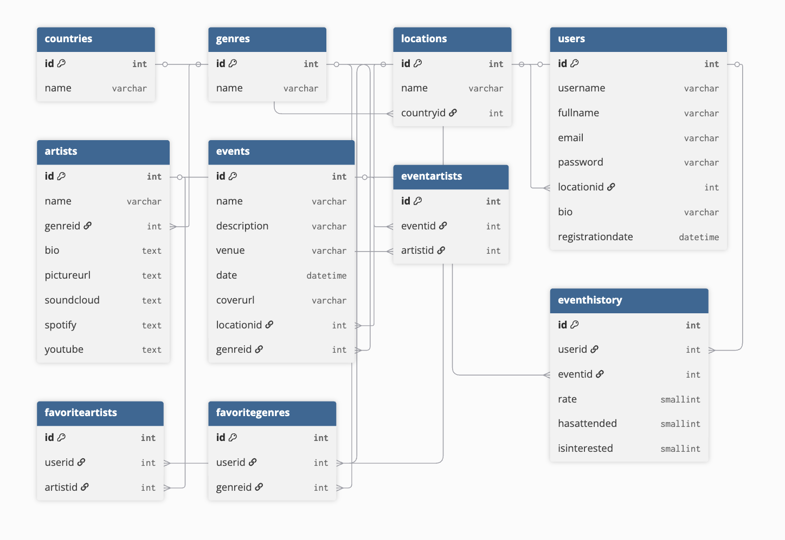

# 📊Techno-Analytics

## 🏙️Company
**Techno Analytics** – This dataset is part of a research project aimed at developing a hybrid recommendation system for techno music events. The database stores user preferences, event details, artist metadata, and recommendation interactions, making it a valuable dataset for music recommendation research, user preference modeling, and event-based recommendation systems.
---

## 📌Project Overview
This project uses a dataset of techno events, artists, and user interactions to:  
- Track events by location and country.  
- Analyze user preferences for artists and genres.  
- Evaluate event attendance and ratings.  
- Provide recommendations based on favorite artists and genres.  

The project is built on PostgreSQL with Python scripts for data import and analysis, and includes SQL queries for generating insights.

---

## Step-by-Step Instructions

1. **Clone the repository**:
   ```bash
   git clone https://github.com/yourusername/Techno-Analytics.git
   cd Techno-Analytics/db

2. **Set up a virtual environment**:

    ```python3 -m venv venv
    source venv/bin/activate
    pip install psycopg2 pandas


3. **Create database schema**:

    ```bash
    python3 setup_db.py

4. **Import data from CSV files**:

    ```bash
    python3 import_data.py


5. **Run SQL queries**:

    ```Open queries.sql in pgAdmin and execute queries directly.
    Or run with Python:
    python3 main.py

6. **Tools & Resources**:

    ```PostgreSQL – relational database system

    pgAdmin – GUI for managing PostgreSQL

    Python (pandas, psycopg2) – for data import and query execution

    GitHub – project repository and version control

    dbdiagram.io – ER diagram visualization


7. **Repository Structure**:

Techno-Analytics/
│── README.md
│── queries.sql
│── db/
│   │── setup_db.py
│   │── import_data.py
│   │── main.py
│   │── archive/ (CSV dataset from Kaggle)
│   │── venv/ (virtual environment - excluded from git)


